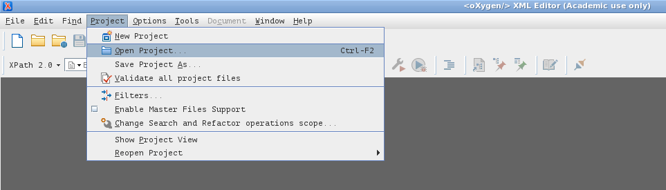
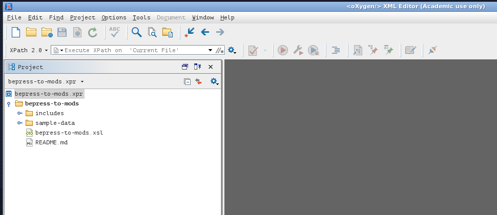
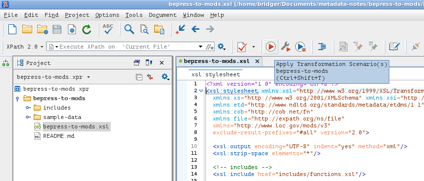
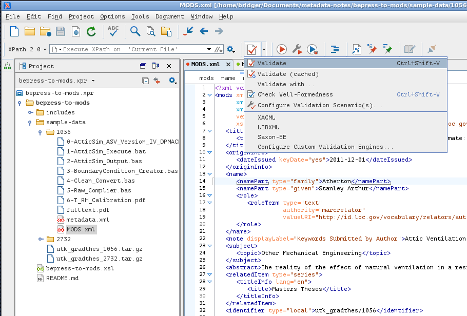

## bepress-to-mods ##
### ~ A Metadata Transformation ~ ###

This is a repository for converting the BePress-specific metadata (available in their quarterly TARs) to MODS XML that meets the requirements of [the data dictionaries](https://wiki.lib.utk.edu/display/DLP/2016+Migration+Data+Dictionaries) on the UTK Digital Initiatives wiki.

### What it does ###

#### sample-data ####
Grab one or both of the TAR archives attached to [TRAC-128](https://jira.lib.utk.edu/browse/TRAC-128). For privacy reasons, those files will not be stored in this repository. After unpacking the archive(s) into `sample-data/`, you're ready for the next step.

#### applying the transform ####
**NOTE:** this is a preliminary transform, still under development. Applying it vs an entire bepress data dump may not be a very good idea. 

~~Here are two possible ways of applying this transform: A) using oXygen or B) using Saxon from the command line.~~

Due some functionality requirements, oXygen is required for testing/running this transform\*. We wanted a way to deal with supplemental files, and the EXPath `file` extension functions are only implemented in the Enterprise version of Saxon (Saxon-**EE**). There's a plan for creating a work-around to avoid that particular dependency, but it has not been implemented.

##### Using oXygen's project functionality. #####
 
1. This repository includes an oXygen project file. After starting oXygen, select the **Project** menu > **open project** > select *bepress-to-mods.xpr*

2. This opens the **Project** view in oXygen
3. From the Project View, expand the `bepress-to-mods` directory and double-click `bepress-to-mods.xsl` to open the file.

4. With the assumption that you have an appropriate set of test data in the `sample-data` directory, you can test the transform by clicking the 'Right Directional Arrow In A Squared Circle' icon\*\*

5. The output should be available in `sample-data/$FILE_NUMBER/MODS.xml`. You can validate using the 'Red Check Mark In A Box'.

\* If you have a license for Saxon-EE, then you should be fine and can run this from the CLI.

\*\* **NOT** the real name for this icon!!!
